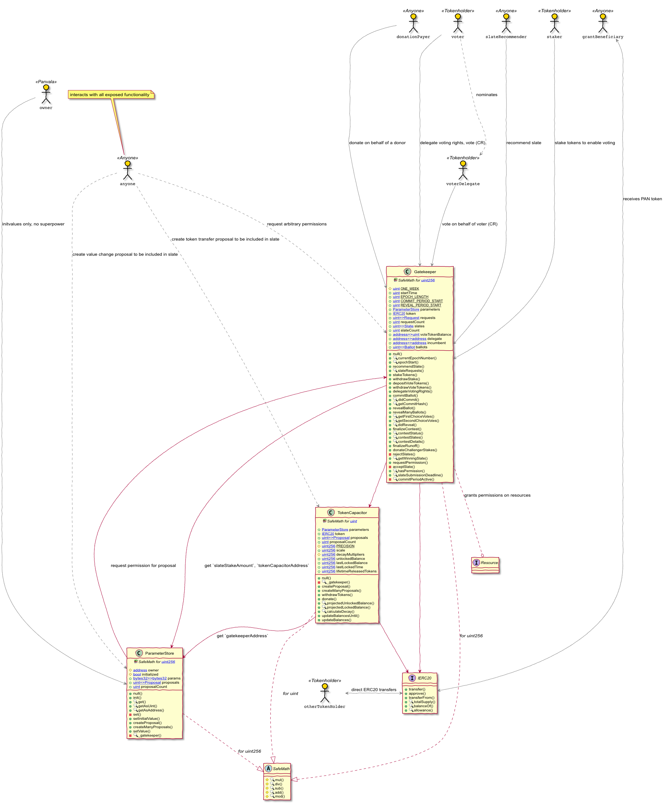
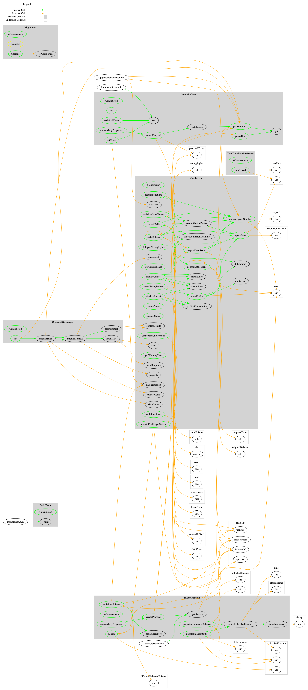

<!-- This file is autogenerated. DO NOT EDIT. -->

# Panvala Audit


* [1 Summary](#1-summary)
* [2 Audit Scope](#2-audit-scope)
* [3 System Overview](#3-system-overview)
  * [3.1 Detailed Design](#31-detailed-design)
* [4 Key Observations/Recommendations](#4-key-observationsrecommendations)
  * [4.1 Notes on Style](#41-notes-on-style)
* [5 Issues](#5-issues)
  * [5.1 Having 2 active gatekeepers for one epoch when changing gatekeeper](#51-having-2-active-gatekeepers-for-one-epoch-when-changing-gatekeeper)
  * [5.2 Anyone can block balance unlocking process](#52-anyone-can-block-balance-unlocking-process)
  * [5.3 `updateBalancesUntil()` function can block TokenCapacitor](#53-updatebalancesuntil-function-can-block-tokencapacitor)
  * [5.4 Request validation](#54-request-validation)
  * [5.5 Voters should be able to vote for empty slate](#55-voters-should-be-able-to-vote-for-empty-slate)
  * [5.6 Stakes can be blocked forever](#56-stakes-can-be-blocked-forever)
  * [5.7 Almost impossible to approve some requests](#57-almost-impossible-to-approve-some-requests)
  * [5.8 Anyone can block current epoch&#x27;s requests](#58-anyone-can-block-current-epochs-requests)
  * [5.9 ParameterStore - Owner may choose to never initialize the contract](#59-parameterstore---owner-may-choose-to-never-initialize-the-contract)
  * [5.10 Staked tokens should be able to participate in voting](#510-staked-tokens-should-be-able-to-participate-in-voting)
  * [5.11 Votes validation](#511-votes-validation)
  * [5.12 No need to reject the slates](#512-no-need-to-reject-the-slates)
  * [5.13 Requests execution time inconsistency](#513-requests-execution-time-inconsistency)
  * [5.14 Gatekeeper: two array-out-of-bounds errors in function revealManyBallots](#514-gatekeeper-two-array-out-of-bounds-errors-in-function-revealmanyballots)
  * [5.15 `projectedLockedBalance` and `projectedUnlockedBalance` may use outdated balance](#515-projectedlockedbalance-and-projectedunlockedbalance-may-use-outdated-balance)
  * [5.16 Conditional requests](#516-conditional-requests)
  * [5.17 Anyone can copy somebody&#x27;s vote](#517-anyone-can-copy-somebodys-vote)
  * [5.18 ParameterStore - proposals are kept forever](#518-parameterstore---proposals-are-kept-forever)
  * [5.19 ParameterStore - constructor should check that array lengths match](#519-parameterstore---constructor-should-check-that-array-lengths-match)
  * [5.20 Gatekeeper can approve withdrawing more funds than `unlockedBalance`](#520-gatekeeper-can-approve-withdrawing-more-funds-than-unlockedbalance)
  * [5.21 Some function visibilities can be set to external](#521-some-function-visibilities-can-be-set-to-external)
  * [5.22 \[WIP\] TokenCapacitor - `scale` can be constant](#522-wip-tokencapacitor---scale-can-be-constant)
  * [5.23 Require latest Solidity version](#523-require-latest-solidity-version)
  * [5.24 Use arrays instead of mappings where possible](#524-use-arrays-instead-of-mappings-where-possible)
  * [5.25 TokenCapacitor - `createManyProposals` calls ParameterStore to get the Gatekeeper address for every supplied proposal](#525-tokencapacitor---createmanyproposals-calls-parameterstore-to-get-the-gatekeeper-address-for-every-supplied-proposal)
* [6 Tool-Based Analysis](#6-tool-based-analysis)
  * [6.1 MythX](#61-mythx)
  * [6.2 Ethlint](#62-ethlint)
  * [6.3 Surya](#63-surya)
* [Appendix 1  - Disclosure](#appendix-1----disclosure)


## 1 Summary

ConsenSys Diligence conducted a security audit on Panvala, a donor-driven platform that helps fund the work that the whole Ethereum community depends on. The Panvala platform is used by PAN token holders to determine which grant applications should be funded using a process called slate governance.

* **Project Name:** [Panvala](https://www.panvala.com/)
* **Client Name:** Panvala
* **Client Contact:** Niran Babalola
* **Lead Auditor:** John Mardlin
* **Co-auditors:** Sergii Kravchenko, Martin Ortner,
* **Date:** July 29, 2019

## 2 Audit Scope

This audit covered the following files from the commit# `d65744451d3aa22c3dc2a91cd27241494a4f94d5`:

| File Name          | SHA-1 Hash                               |
| ------------------ | ---------------------------------------- |
| Gatekeeper.sol     | cf1dafb4152218ec6a3f2994001e365c2cc3b389 |
| TokenCapacitor.sol | 0a8ed87547ae9066653c18257dd560bf378ed1c1 |
| ParameterStore.sol | 55982f874178099408caf589338851b517cf3096 |

The following contracts are out of scope of this audit and are mainly used for testing purposes:

* `Migrations.sol`
* `dev/UpgradedGatekeeper.sol`
* `dev/TimeTravelingGatekeeper.sol`

The following documentation was available to the audit team:

* [Whitepaper](https://v.fastcdn.co/u/b75396d2/44139515-0-Panvala-Whitepaper-J.pdf)
* Natspec comments and other inline comments in the codebase

The audit team evaluated that the system is secure, resilient, and working according to its specifications. The audit activities can be grouped into the following three broad categories:

1. **Security:** Identifying security related issues within the contract.
2. **Architecture:** Evaluating the system architecture through the lens of established smart contract best practices.
3. **Code quality:** A full review of the contract source code. The primary areas of focus include:
   * Correctness
   * Readability
   * Scalability
   * Code complexity
   * Quality of test coverage

## 3 System Overview

The system is comprised of the three contracts `Gatekeeper`, `TokenCapacitor`, `ParameterStore` and a `ERC20` compliant `PAN` panvala system token (`BaseToken`).


### 3.1 Detailed Design

This and the following sections describe the top-level contracts, their inheritance structure, actors, permissions and the contract interactions. Security centric information about actors in this system can be found in the section [Actors](#51-actors).

The following graphic depicts a high-level view of the contract system. 

**Legend:** 
- `(C)`: Contract
- `(A)`: Library 
- `(I)`: Interface
-  White arrows denote an inheritance or `using ... for` relationship
-  Methods and state variables can be 
   -  public (`green`)
   -  internal (`yellow`)
   -  private (`red`). 
-  Constant variables are _underlined._ 
-  `view`, `pure` or `constant` methods that are not allowed to change any state are marked with 🔍.



The full system is comprised of 4 distinct contracts, the PAN Token (ERC20), the Parameter Store, the Gatekeeper, and the Token Capacitor.

#### Pan Token

The PAN token is written as a simple wrapper around the well tested OpenZeppelin implementation of the ERC20 standard. There are 100 million Panvala tokens initially created, with no functionality provided for minting or burning. 

Panvala coordinates donations by issuing grants of PAN to workers. Donors can buy those tokens and donate them back to the token capacitor.

#### Token Capacitor

At launch, half of the PAN tokens will be distributed to the Panvala team and other launch partners (see whitepaper for details). The other half will be locked in the Token Capacitor, which controls the release of PAN tokens at a predictable rate. 

The balance of PAN tokens held in the Capacitor will have a half life of 4 years, similar to Bitcoin's. Thus whatever the current balance is,  half of it will be released during the course of the next 4 years, leaving half of it locked. There is however one important difference from Bitcoin; token holders can donate PAN back to the capacitor. A donation should increase each of these properties:

1. the _locked balance_ held in the Token Capacitor
2. the rate at which tokens are released
3. the time until all tokens have been released

Grant `proposals` can be submitted to withdraw tokens from the Capacitor's unlocked balance. These `proposals` must be approved by the Gate Keeper contract, the process for which is described below.

#### Resources

The Token Capacitor is a specific (and currently the only) instance of a `resource` contract. Other `resource` contracts may be launched, which make use of the Gatekeeper's governance and community by calling the following interface on the Gatekeeper:

- `function​ requestPermission​(​bytes​ ​memory​ ​metadataHash​) ​public​ ​returns​(​uint​)`
- `function​ hasPermission​(​uint​ ​requestID​) ​public​ ​view​ ​returns​(​bool​)`

In this way, requests to perform an action can be submitted, and permission can be granted or rejected by Gatekeeper governance.

This flexibility means that the system can be extended by adding new resource contracts, such as another token capacitor, or potentially more general 'smart wallet' which can hold funds and send transactions on behalf of the Gatekeeper. 

Ballots and slates are specific to a given resource.


#### Gatekeeper

The Gatekeeper contract implements the governance process to decide which `proposals` should be approved. Key aspect of the governance process, and the Gatekeeper's design include:

- **Requests and Permission:** Proposals to withdraw are submitted to the Token Capacitor, which then  submits a request to the Gatekeeper. This request contains a `metaDataHash`, which can be used to look up information about the proposal. There is no requirement that the `metaDataHash` be unique on either the Token Capacitor or the Gatekeeper, as long as it is non-zero.

- **Slates and Staking:** Anyone can call `recommendSlate()` and submit a list of requests, each of which corresponds to a `proposal` on the Token Capacitor. Once the slate is listed, anyone with enough PAN tokens can deposit them to the Gatekeeper, thus adding the slate to the ballot for voting in the current epoch. 

- **Epochs:** An Epoch is 13 weeks in length. The first epoch begins at the `startTime` defined in the constructor. 
Each epoch is divided into 3 distinct phases:

1. The first 11 weeks, during which slates can be recommended and staked on.
2. The 12th week, during which token holders can commit to voting on a specific slate.
3. The 13th week, during which token holders must reveal their votes.

- **Commit and reveal voting:** Voters must submit a salted hash, along with a deposit of their vote during the 12th week. During the 13th week, they must reveal the details of their vote in order to be counted. Voters may also assign the right to vote with the tokens to a delegate.

- **Contests:** A Contest is the list of slates being voted on, for a given resource, within an epoch. 

- **Ballots:** A Ballot contains all of the contests for all resources, and also holds tracks each voters commitment to their vote.

- **Social layer:** At the end of an epoch, after voting is finalized, the Gatekeeper contract records the `recommender` of the winning contract as the `incumbent`.

- **Resource agnostic:** The system is 'resource agnostic', in the sense that any resource can be plugged into the Gatekeeper, and be governed by its process. The only  functionality specific to the Token Capacitor is that the Gatekeeper's `donateChallengerStakes()` function, which donates PAN tokens to the Token Capacitor, regardless of which resource the slate stake belonged to.

#### Parameter Store

This is a datastore inspired by the `Parameterizer/EternalStorage` pattern. Both the Gatekeeper and TokenCapacitor's behavior can change based on data in the ParameterStore contract. In the system we audited, there are 3 values held in the ParameterStore:

1. The minimum staking amount required to create a slate (used by the Gatekeeper).
2. The address of the Token Capacitor (used by the Gatekeeper).
3. The address of the Gatekeeper (used by the Token Capacitor). 

Because the Gatekeeper and Token Capacitor addresses can be updated, the Parameter Store and the PAN token are therefore the only permanent contracts in the system.

#### System Call Graph

The following graphic shows the call-graph of the system. Externally reachable methods are `red`, internal functions are `yellow`.

<p align="center">
<figcaption>
 <a href="./tool-output/surya/surya-graph.dot">[dot file]</a>
 </figcaption>
 </p>


#### System Inheritance Graph

A complete view of the inheritance structure:

<p align="center">
<figcaption>
 <a href="./tool-output/surya/surya-inheritance.dot">[dot file]</a>
 </figcaption>
 </p>

## 4 Key Observations/Recommendations

Many of the issues identified can be viewed as opportunities to improve the architecture from our perspective, but do not necessarily indicate a bug. Although several issues were closed as `WontFix`, we are not aware of any vulnerabilities remaining in the code.


The following contracts, `TimeTravelingGatekeeper`, `UpgradedGatekeeper` and `Migrations`, are not part of the deployed system and only used for testing purposes. `BasicToken` is a standard `ERC20` token based on openzeppelin-solidity `ERC20` and `ERC20Detailed`.

### 4.1 Notes on Style

* We observed mixed use of alias type `uint` and type `uint256` throughout the code-base. Stick to either the alias or the concrete type `uint256` (preferred).
* A `TODO` note remains on line 79 of ParameterStore.sol
## 5 Issues

Each issue has an assigned severity:

* **Minor** issues are subjective in nature. They are typically suggestions around best practices or readability. Code maintainers should use their own judgment as to whether to address such issues.
* **Medium** issues are objective in nature but are not security vulnerabilities. These should be addressed unless there is a clear reason not to.
* **Major** issues are security vulnerabilities that may not be directly exploitable or may require certain conditions in order to be exploited. All major issues should be addressed.
* **Critical** issues are directly exploitable security vulnerabilities that need to be fixed.

The following table contains all the issues discovered during the audit, ordered based on their severity.

| Chapter      | Issue Title             | Issue Status | Severity    |
|:------------:| ----------------------- |:------------:|:-----------:|
| 5.1  | [Having 2 active gatekeepers for one epoch when changing gatekeeper](#51-having-2-active-gatekeepers-for-one-epoch-when-changing-gatekeeper) | Closed  | Critical |
| 5.2  | [Anyone can block balance unlocking process](#52-anyone-can-block-balance-unlocking-process) | Closed  | Critical |
| 5.3  | [`updateBalancesUntil()` function can block TokenCapacitor](#53-updatebalancesuntil-function-can-block-tokencapacitor) | Closed  | Critical |
| 5.4  | [Request validation](#54-request-validation) | Closed  | Major |
| 5.5  | [Voters should be able to vote for empty slate](#55-voters-should-be-able-to-vote-for-empty-slate) | Closed  | Major |
| 5.6  | [Stakes can be blocked forever](#56-stakes-can-be-blocked-forever) | Closed  | Major |
| 5.7  | [Almost impossible to approve some requests](#57-almost-impossible-to-approve-some-requests) | Closed  | Major |
| 5.8  | [Anyone can block current epoch&#x27;s requests](#58-anyone-can-block-current-epochs-requests) | Closed  | Major |
| 5.9  | [ParameterStore - Owner may choose to never initialize the contract](#59-parameterstore---owner-may-choose-to-never-initialize-the-contract) | Closed  | Major |
| 5.10  | [Staked tokens should be able to participate in voting](#510-staked-tokens-should-be-able-to-participate-in-voting) | Closed  | Major |
| 5.11  | [Votes validation](#511-votes-validation) | Closed  | Medium |
| 5.12  | [No need to reject the slates](#512-no-need-to-reject-the-slates) | Closed  | Medium |
| 5.13  | [Requests execution time inconsistency](#513-requests-execution-time-inconsistency) | Closed  | Medium |
| 5.14  | [Gatekeeper: two array-out-of-bounds errors in function revealManyBallots](#514-gatekeeper-two-array-out-of-bounds-errors-in-function-revealmanyballots) | Closed  | Medium |
| 5.15  | [`projectedLockedBalance` and `projectedUnlockedBalance` may use outdated balance](#515-projectedlockedbalance-and-projectedunlockedbalance-may-use-outdated-balance) | Closed  | Medium |
| 5.16  | [Conditional requests](#516-conditional-requests) | Closed  | Medium |
| 5.17  | [Anyone can copy somebody&#x27;s vote](#517-anyone-can-copy-somebodys-vote) | Closed  | Medium |
| 5.18  | [ParameterStore - proposals are kept forever](#518-parameterstore---proposals-are-kept-forever) | Closed  | Medium |
| 5.19  | [ParameterStore - constructor should check that array lengths match](#519-parameterstore---constructor-should-check-that-array-lengths-match) | Closed  | Medium |
| 5.20  | [Gatekeeper can approve withdrawing more funds than `unlockedBalance`](#520-gatekeeper-can-approve-withdrawing-more-funds-than-unlockedbalance) | Closed  | Medium |
| 5.21  | [Some function visibilities can be set to external](#521-some-function-visibilities-can-be-set-to-external) | Closed  | Medium |
| 5.22  | [\[WIP\] TokenCapacitor - `scale` can be constant](#522-wip-tokencapacitor---scale-can-be-constant) | Closed  | Minor |
| 5.23  | [Require latest Solidity version](#523-require-latest-solidity-version) | Closed  | Minor |
| 5.24  | [Use arrays instead of mappings where possible](#524-use-arrays-instead-of-mappings-where-possible) | Closed  | Minor |
| 5.25  | [TokenCapacitor - `createManyProposals` calls ParameterStore to get the Gatekeeper address for every supplied proposal](#525-tokencapacitor---createmanyproposals-calls-parameterstore-to-get-the-gatekeeper-address-for-every-supplied-proposal) | Closed  | Minor |

### 5.1 Having 2 active gatekeepers for one epoch when changing gatekeeper

| Severity     | Status    | Remediation Comment |
|:------------:|:---------:| ------------------- |
| Critical | Closed | Fixed in https://github.com/ConsenSys/panvala/pull/164 |

#### Description

It's possible to change gatekeeper's address in `ParameterStore` contract. If that happens, all the requests that are made in this epoch before the "change" will go to the old gatekeeper and all other requests will go to the new gatekeeper. 
The problem is that both gatekeepers will have their voting process by the end of this epoch and voters should decide how much tokens they would use in each of the gatekeepers for voting. 
The fact that there will still be a voting process in the old gatekeeper is not obvious and some requests may go through with small voting power.

#### Remediation

Migrate all requests that are not expired (pending and approved) from the old gatekeeper to the new one. Do not store the address of the gatekeeper in `TokenCapacitor` and `ParameterStore` on creating requests.
### 5.2 Anyone can block balance unlocking process

| Severity     | Status    | Remediation Comment |
|:------------:|:---------:| ------------------- |
| Critical | Closed | Fixed in https://github.com/ConsenSys/panvala/pull/153 |

#### Description

If `updateBalances` function is called in less than 1 day after the previous call, there will be no change in unlocked balance value. It happens so because the time difference is divided by `86400 seconds = 1 day`.


**code/governance-contracts/contracts/TokenCapacitor.sol:L227-L235**
```solidity
function projectedLockedBalance(uint256 time) public view returns(uint256) {
    require(time >= lastLockedTime, "Time cannot be before last locked");
    uint256 elapsedTime = time.sub(lastLockedTime);

    // Based on the elapsed time (in days), calculate the decay factor
    uint256 decayFactor = calculateDecay(elapsedTime.div(86400));

    return lastLockedBalance.mul(decayFactor).div(scale);
}
```

The problem is that even though unlocked balance will not be changed, `lastLockedTime` will be changed and will be used for the next `updateBalances`. 

https://github.com/ConsenSys/panvala-audit-internal-2019-07/blob/master/code/governance-contracts/contracts/TokenCapacitor.sol#L275%20-%20L284

The same situation will happen again and again on every call of `updateBalances` function if it's called more often than once per day. This way, since this function can be called by anyone, unlocked balance will never be increased if someone wants it to be locked.

#### Remediation

Instead of using `now` it's better to always use the start of the current day in `updateBalancesUntil()` function. It will ensure that `lastLockedTime` and `time` will always be the start of the day and `(time - lastLockedTime) % 86400 == 0` will always be true.
### 5.3 `updateBalancesUntil()` function can block TokenCapacitor

| Severity     | Status    | Remediation Comment |
|:------------:|:---------:| ------------------- |
| Critical | Closed | Fixed in https://github.com/ConsenSys/panvala/pull/153. `updateBalances()` can now potentially run out of gas if it hasn&#x27;t been called for a very long time, but the amount of time needed is too big so it&#x27;s almost impossible. |

#### Description

In `TokenCapacitor` contract `updateBalancesUntil()` function can be called by anyone with an arbitrary value of `time` parameter.


**code/governance-contracts/contracts/TokenCapacitor.sol:L270**
```solidity
function updateBalancesUntil(uint256 time) public {
```

If someone calls this function with huge value in `time` parameter `(lastLockedTime + 4095 days)`, `TokenCapacitor` will eventually be blocked, because `lastLockedTime` would be much bigger than `now` and `updateBalances()` function will always revert. `updateBalances()` is called in all important functions of `TokenCapacitor`.

`updateBalancesUntil()` function is made public because if nobody calls `updateBalances()` function for more than 4096 days, it will revert. So if that happens, `updateBalancesUntil()` function should be called first with some `time` from the past, so `time < 4096 + lastLockedTime`.

#### Remediation

Make `updateBalancesUntil()` function `private`. Then add logic to `updateBalance()`, so that if more than 4096 days has passed, it calls `updateBalanceUntil()` multiple times with intervals less than 4096.
### 5.4 Request validation

| Severity     | Status    | Remediation Comment |
|:------------:|:---------:| ------------------- |
| Major | Closed | Fixed in https://github.com/ConsenSys/panvala/pull/165 |

#### Description

Currently, it's possible to include old requests that are either expired or already approved.
There is a minimum request validation that only checks if this request belongs to the right `resource`.


**code/governance-contracts/contracts/Gatekeeper.sol:L256-L265**
```solidity
for (uint i = 0; i < requestIDs.length; i++) {
    uint requestID = requestIDs[i];
    require(requestID < requestCount, "Invalid requestID");

    // Every request's resource must match the one passed in
    require(requests[requestID].resource == resource, "Resource does not match");

    require(slates[slateID].requestIncluded[requestID] == false, "Duplicate requests are not allowed");
    slates[slateID].requestIncluded[requestID] = true;
}
```

#### Remediation

Add necessary checks, so only unapproved requests with valid expiration time should be added to the slate.
### 5.5 Voters should be able to vote for empty slate

| Severity     | Status    | Remediation Comment |
|:------------:|:---------:| ------------------- |
| Major | Closed | Closed as WontFix. The development team explained that having a default, &#x27;do nothing&#x27; slate with no staking required creates a bias towards doing nothing. |

#### Description

Sometimes there might be a situation when there are no good requests or there are no slates with a good set of requests. In that situation, voters are not able to vote against all the slates. To do so, someone should explicitly create a slate with 0 requests in it. The problem is that this person will get his stake at risk. Additionally, if the stake is too high, not a lot of people would be able to create a slate even though together these voters might have the majority.

#### Remediation

Add a default "zero slate" (slot with zero requests), so voters will be able to vote against all the staked slates.

### 5.6 Stakes can be blocked forever

| Severity     | Status    | Remediation Comment |
|:------------:|:---------:| ------------------- |
| Major | Closed | Fixed in https://github.com/ConsenSys/panvala/pull/166|

#### Description

After determination of the winner in the current epoch, all the stakes from the slates that did not win should be donated to the `TokenCapacitor`. In order to do that, `donateChallengerStakes()` function should be called. In this function, there is a for loop that iterates over all the staked slates and donates tokens from each slate to the `TokenCapacitor`.
The problem is that if there are a lot of staked tokens, this function will always revert because of the gas limit and it will be impossible to use these tokens in any way.

#### Remediation

Have the function that donates tokens from only a part of the staked slates. For example `donateChallengerStakes(uint epochNumber, address resource, uint start, uint count)`
### 5.7 Almost impossible to approve some requests

| Severity     | Status    | Remediation Comment |
|:------------:|:---------:| ------------------- |
| Major | Closed | Fixed in https://github.com/ConsenSys/panvala/pull/147 |

#### Description

Every request to Gatekeeper has an expiration time. If the request is created in epoch n, expire at the start of epoch n + 2.


**code/governance-contracts/contracts/Gatekeeper.sol:L917**
```solidity
uint256 expirationTime = epochStart(currentEpochNumber().add(2));
```

The problem is that if a request is created after the submission period, it's impossible to approve this request. It happens so because this request can only be added to a slate in the next period (n+1) and it can only be accepted on (n+2) period, but it expires at the beginning of n+2 period.

The only way how this request can be approved is if the next epoch will have only one staked slate [issue 5.13](#513-requests-execution-time-inconsistency).

#### Remediation

Reject creation of requests that cannot be accepted before the expiration time.

### 5.8 Anyone can block current epoch&#x27;s requests

| Severity     | Status    | Remediation Comment |
|:------------:|:---------:| ------------------- |
| Major | Closed | Fixed in https://github.com/ConsenSys/panvala/pull/167  |

#### Description

In order to determine a winning slate, `finalizeContest` and `finalizeRunoff` should iterate over all staked slates of the current epoch. If there are too many slates, it may take too much gas and hit the gas limit. If that happens, it would be impossible to determine winning slate and all requests from that epoch will be denied.

This issue is partially mitigated:
1. This attack requires a lot of slates to be registered and a lot of tokens put on these slates as stakes.
1. These stakes will be blocked forever.
1. The whole system would not collapse, new epoch will still be working normally unless someone will do the same again.
1. It's only possible if the stake value is relatively small.

#### Remediation

Do not use loops over arrays with unlimited length. It's possible to precalculate a winner while revealing the votes one by one. The last reveal will contain the winner and there would be no need to call `finalizeContest` or `finalizeRunoff`. In this way, the contest will be considered as finalized at the start of the next epoch. All the actions (requests executions, stakes donations, etc.) related to the contest results should also be done in the next epoch.
### 5.9 ParameterStore - Owner may choose to never initialize the contract

| Severity     | Status    | Remediation Comment |
|:------------:|:---------:| ------------------- |
| Major | Closed | Fixed in https://github.com/ConsenSys/panvala/pull/156 and https://github.com/ConsenSys/panvala/pull/176 |

#### Description

The `ParameterStore` lifecycle is as follows:
* An ethereum account deploys the contract, providing an initial set of `name=>value` pairs to initialize the param store. The contract remains in `uninitialized` state and the deployer iss set as the `owner` for the contract.
* The `owner` of the contract can choose to further initialize the contract with individual `key=>value` pairs by calling `setInitialValue()` until the method `init()` is called, blocking the `owner` from initializing or overriding values from that point in time on. Calling the `init()` method puts the contract into production mode requiring everyone to go through the voting process to change values.

However, the `owner` may choose to never call `init()` and remain in control of the `ParameterStore` being able to arbitrarily change values without requiring a proposal to perform it (via `setInitialValue()`). The fact that the `ParameterStore` was never initialized is **not visible** and cannot be manually checked as `ParameterStore.initialized` is missing a visibility modifer which turns it to default visiblity of `internal`.


**code/governance-contracts/contracts/ParameterStore.sol:L26-L27**
```solidity
address owner;
bool initialized;
```

In addition, none of the methods meant to be used in production mode (i.e. when `initialized==true`) are bailing if the contract is uninitialized.

* `set()` does not bail if the contract is uninitialized allowing the `owner` to arbitrarily override values.

**code/governance-contracts/contracts/ParameterStore.sol:L107-L111**
```solidity
function set(string memory _name, bytes32 _value) private {
    bytes32 key = keccak256(abi.encodePacked(_name));
    params[key] = _value;
    emit ParameterSet(_name, key, _value);
}
```

* `setValue()` and `createProposal()` and possibly other methods should bail indicating that the contract is not yet meant to be used in production.

#### Remediation

1. All methods meant to be used in the initialized (ie. production) mode, should revert if the contract has not been initialized. This will prevent the owner from bypassing the Gatekeeper's voting process, and arbitrarily overriding values in the parameter store.

2. Make the initialized variable public in order to be transparent about whether the contract is initialized or not.
### 5.10 Staked tokens should be able to participate in voting

| Severity     | Status    | Remediation Comment |
|:------------:|:---------:| ------------------- |
| Major | Closed | Closed as WontFix. |

#### Description

Currently, each slate that participates in competition has a stake of tokens that are not used in voting. If the stake amount is big enough, there will be a lot of tokens locked as stakes that cannot be used for `secondChoiceVote` if their slate is not winning. 

Additionally, if there are no votes in some epoch, all the staked slates would be rejected, but stakes on that tokens should also be considered as votes.

#### Remediation

Allow using stakes for voting (both, first and second choice votes).

### 5.11 Votes validation

| Severity     | Status    | Remediation Comment |
|:------------:|:---------:| ------------------- |
| Medium | Closed | Fixed in https://github.com/ConsenSys/panvala/pull/167/ |

#### Description

Voters can vote for any `slateID` which might not even exist, there is no input validation for `firstChoices` and `secondChoices`.


**code/governance-contracts/contracts/Gatekeeper.sol:L533-L538**
```solidity
uint firstChoice = firstChoices[i];
SlateVotes storage slateVotes = contest.votes[firstChoice];
slateVotes.firstChoiceVotes = slateVotes.firstChoiceVotes.add(v.numTokens);

uint secondChoice = secondChoices[i];
slateVotes.secondChoiceVotes[secondChoice] = slateVotes.secondChoiceVotes[secondChoice].add(v.numTokens);
```


#### Remediation

Ignore `firstChoices` and `secondChoices` with invalid `slateID` (check if this slate is staked and belong to current epoch).
### 5.12 No need to reject the slates

| Severity     | Status    | Remediation Comment |
|:------------:|:---------:| ------------------- |
| Medium | Closed | Fixed in ConsenSys/panvala#168

 |

#### Description

Currently, when finalizing the contest, all slates that are not accepted are getting rejected by calling `rejectSlates()` function. It iterates over all the staked slates which might be very gas costly.  
The only place where `SlateStatus.Rejected` is used is `donateChallengerStakes()` and it's only executed when the contest is finalised.

#### Remediation

There is no need to explicitly reject the slates because if the contest is finalized and a slate is not accepted, it can automatically be considered as rejected.

### 5.13 Requests execution time inconsistency

| Severity     | Status    | Remediation Comment |
|:------------:|:---------:| ------------------- |
| Medium | Closed | Fixed in https://github.com/ConsenSys/panvala/pull/155 |

#### Description

Usually, all the approved requests are only possible to execute in the next epoch after the voting.
But if there were no other slates with stakes, the slate wins after the submission deadline automatically and request can be executed in the same epoch. It increases the complexity of the system.

#### Remediation

There should be consistent and predictable execution time. It's better to have all the requests executed in the next epoch only.

### 5.14 Gatekeeper: two array-out-of-bounds errors in function revealManyBallots

| Severity     | Status    | Remediation Comment |
|:------------:|:---------:| ------------------- |
| Medium | Closed | Fixed in https://github.com/ConsenSys/panvala/pull/148/files#diff-4067f105b0aeae4aad43e1dac16f8aefR557 |

#### Description

In function `Gatekeeper.revealManyBallots`, an array-out-of-bounds error (invalid opcode on the EVM-level) may happen if `_salts.length < _voters.length` or `_ballots.length < _voters.length`. The Harvey fuzzer was able to trigger both of these cases (see tool output for concrete test cases).


**code/governance-contracts/contracts/Gatekeeper.sol:L550-L568**
```solidity
function revealManyBallots(
    uint256 epochNumber,
    address[] memory _voters,
    bytes[] memory _ballots,
    uint[] memory _salts
) public {
    uint numBallots = _voters.length;

    for (uint i = 0; i < numBallots; i++) {
        // extract resources, firstChoices, secondChoices from the ballot
        (
            address[] memory resources,
            uint[] memory firstChoices,
            uint[] memory secondChoices
        ) = abi.decode(_ballots[i], (address[], uint[], uint[]));

        revealBallot(epochNumber, _voters[i], resources, firstChoices, secondChoices, _salts[i]);
    }
}
```

#### Remediation

```Solidity
require(_salts.length == _voters.length && _ballots.length == _voters.length, "Inputs must have the same length");`
```

### 5.15 `projectedLockedBalance` and `projectedUnlockedBalance` may use outdated balance

| Severity     | Status    | Remediation Comment |
|:------------:|:---------:| ------------------- |
| Medium | Closed | Closed as WontFix. |

#### Description

The `projectedUnlockedBalance` and `projectedLockedBalance` functions are based on the `lastLockedBalance` variable, which may be inaccurate if donations are made without calling `donate()`. 

Both of these functions have `public view` visibilities on them, so can be called and return inaccurate data to contracts outside the system. The `updateBalancesUntil()` function is also affected, because despite checking the current balance, the `unlockedBalance` and `lastLockedBalance` are both dependent on the incorrect `projectedUnlockedBalance`.

#### Remediation

1. Any function that calculates future balances needs to use the current actual balance.
2. Write tests that simulate real world situations, checking how the balance changes with a combination of time passing and donations being made. 
### 5.16 Conditional requests

| Severity     | Status    | Remediation Comment |
|:------------:|:---------:| ------------------- |
| Medium | Closed | Closed as WontFix |

#### Description

Sometimes there might be a need for requests that should be executed in a specific order or that should be executed only if some other request if accepted (and executed) also.
Currently, it's only possible to implement by having one request per epoch, but every epoch is 3 months and it takes a lot of time.

#### Examples

There is a request to change the gatekeeper and this gatekeeper requires some parameter changes in `ParameterStore`. These parameter changes should only be done if gatekeeper change is accepted and if it is already changed. 

#### Remediation

Each request may have a link to another request that should be executed before the execution of this request.
### 5.17 Anyone can copy somebody&#x27;s vote

| Severity     | Status    | Remediation Comment |
|:------------:|:---------:| ------------------- |
| Medium | Closed | Closed as WontFix. |

#### Description

The voting process for the slates is supposed to be encrypted and every actual vote should only be revealed after everyone submitted their votes. 
But there is a way to get around these rules and copy somebody's vote. It only takes to submit the same `commitHash`. And then reveal your vote with the same `salt` as the person who's vote you want to copy.

If that behaviour becomes a pattern at some point, the initial voter may choose not to reveal the vote and all others who copied the vote will not be able to reveal their votes also.

#### Remediation

Include a voter's address to the voting structure that is hashed.
### 5.18 ParameterStore - proposals are kept forever

| Severity     | Status    | Remediation Comment |
|:------------:|:---------:| ------------------- |
| Medium | Closed | Closed as WontFix. |

#### Description

`ParameterStore` keeps proposals forever and there is no way to remove them from the contracts storage. The mapping that stores proposals is public and could be accessed by other components in the system. However, we did not find any other component requiring calling out to the `ParameterStore` to access individual `ParameterStore` value change proposals or the full history of already executed proposals. Keeping a history of proposals might therefore be unnecessary.


**code/governance-contracts/contracts/ParameterStore.sol:L40-L40**
```solidity
mapping(uint => Proposal) public proposals;
```

Proposals are marked as `executed` when the proposed value change is performed. The proposal is not removed from storage. 


**code/governance-contracts/contracts/ParameterStore.sol:L184-L200**
```solidity
function setValue(uint256 proposalID) public returns(bool) {
    require(proposalID < proposalCount, "Invalid proposalID");

    Proposal memory p = proposals[proposalID];
    Gatekeeper gatekeeper = Gatekeeper(p.gatekeeper);

    require(gatekeeper.hasPermission(p.requestID), "Proposal has not been approved");
    require(p.executed == false, "Proposal already executed");

    proposals[proposalID].executed = true;

    set(p.key, p.value);

    emit ProposalAccepted(proposalID, p.key, p.value);
    return true;
}

```

#### Remediation

Upon executing the proposal it could be purged from the mapping but this requires a semantic change `Proposal.executed` to `Proposal.pending` indicating that the proposal has not yet been executed. Upon deleting the proposal from the mapping it will turn to false allowing the function to bail. Also `proposalCount` is never used to loop through proposals and is only used to create a new internal and unique steadily increasing proposal id. 

### 5.19 ParameterStore - constructor should check that array lengths match

| Severity     | Status    | Remediation Comment |
|:------------:|:---------:| ------------------- |
| Medium | Closed | Fixed in https://github.com/ConsenSys/panvala/commit/d5ae5e25302a02d2b7a898183326331b70490e50 |

#### Description

The constructor assumes that the provided input arrays (key and value pairs) are of the same length but this is not enforced. Make sure that the provided arrays are of the same length as noted by the inline comment.


**code/governance-contracts/contracts/ParameterStore.sol:L51-L59**
```solidity
constructor(string[] memory _names, bytes32[] memory _values) public {
    owner = msg.sender;
    // NOTE: _keys and _values must have the same length

    for (uint i = 0; i < _names.length; i++) {
        string memory name = _names[i];
        set(name, _values[i]);
    }
}
```

#### Remediation

`require(_names.length == _values.length, "Inputs must have the same length")`

### 5.20 Gatekeeper can approve withdrawing more funds than `unlockedBalance`

| Severity     | Status    | Remediation Comment |
|:------------:|:---------:| ------------------- |
| Medium | Closed | Closed as WontFix. |

#### Description

`TokenCapacitor` contract only allows withdrawing a limited amount of tokens that is slowly growing as a result of the exponential decay algorithm. It's theoretically possible for the Panvala governance to approve a slate that allows withdrawing more tokens than TokenCapacitor can give. That will lead to the situation when only people who claim their tokens first will be able to withdraw the tokens. Other proposals will be expired in the next epoch. 

#### Remediation

Does not allow withdrawing more tokens than unlocked balance.
### 5.21 Some function visibilities can be set to external

| Severity     | Status    | Remediation Comment |
|:------------:|:---------:| ------------------- |
| Medium | Closed | Closed as WontFix. |

#### Description

The visibility of all functions in the system is set to either `public` or `private`. 

This is unlikely to be ideal in all cases. Using the proper visibility keywords can provide greater safety and reduce gas costs.

#### Recommendation

Determine and use the [correct visibility according the solidity docs](https://solidity.readthedocs.io/en/v0.5.10/miscellaneous.html?highlight=visibility#function-visibility-specifiers). 

In particular, `public` functions which are not called within other functions in the same contract can be made `external`.
### 5.22 \[WIP\] TokenCapacitor - `scale` can be constant

| Severity     | Status    | Remediation Comment |
|:------------:|:---------:| ------------------- |
| Minor | Closed | Fixed in ConsenSys/panvala#148 and  https://github.com/ConsenSys/panvala/pull/153/files#diff-c677da373c03c821aba7823aaad1e62bR246 |

#### Description

`scale` is only set by `TokenCapacitor.constructor()` by multiplying it with a constant value and can therefore itself be constant.

declaration:

**code/governance-contracts/contracts/TokenCapacitor.sol:L53-L55**
```solidity
// Token decay table
uint256 constant PRECISION = 12;
uint256 public scale;
```

value is set to a constant value. `PRECISION` is constant as well.

**code/governance-contracts/contracts/TokenCapacitor.sol:L95-L95**
```solidity
scale = 10 ** PRECISION;
```


#### Remediation

Remove `PRECISION` in favour of having a constant `SCALE = 10 ** 12`.
### 5.23 Require latest Solidity version

| Severity     | Status    | Remediation Comment |
|:------------:|:---------:| ------------------- |
| Minor | Closed | Fixed in https://github.com/ConsenSys/panvala/pull/176 |

#### Description

Solidity is very active pushing out new versions. Make sure to include the latest stable version that does not break any things especially as the code base is using experimental features like `ABIEncoderV2` with known bugs that can lead to vulnerabilities ([1](https://blog.ethereum.org/2019/03/26/solidity-optimizer-and-abiencoderv2-bug/), [2](https://blog.ethereum.org/2019/06/25/solidity-storage-array-bugs/)) with certain, often outdated solidity versions.

Release Note of  solidity [0.5.10](https://github.com/ethereum/solidity/releases/tag/v0.5.10):
> ABIEncoderV2: Fix incorrect abi encoding of storage array of data type that occupy multiple storage slots

#### Remediation

At the moment of writing, the latest stable version is [0.5.10](https://github.com/ethereum/solidity/releases/tag/v0.5.10).

Contracts should be deployed with the same compiler version and flags that they have been tested with thoroughly. Locking the pragma helps to ensure that contracts do not accidentally get deployed using, for example, an outdated compiler version that might introduce bugs that affect the contract system negatively. Having a floating version can also open your application to newer, possibly not well tested, versions.

```solidity
// Fixed version
pragma solidity 0.5.10; 

// As opposed to a floating pragma
pragma solidity ^0.5.10;
```

#### References

https://github.com/ethereum/solidity/releases
### 5.24 Use arrays instead of mappings where possible

| Severity     | Status    | Remediation Comment |
|:------------:|:---------:| ------------------- |
| Minor | Closed | Fixed in https://github.com/ConsenSys/panvala/commit/682f49c8de7b892dcf788532389f109d79e2146d and https://github.com/ConsenSys/panvala/commit/0a80be85aacc8e6bf80a95858c10d51b8f9d21f9 |

#### Description

When using a `uint` mapping is used with a variable to count entries, both can usually be replaced with a single array. This will greatly improve readability, and protect against mistakenly failing to increment the count.

#### Examples


**code/governance-contracts/contracts/ParameterStore.sol:L40-L43**
```solidity
mapping(uint => Proposal) public proposals;

// The total number of proposals
uint public proposalCount;
```


**code/governance-contracts/contracts/Gatekeeper.sol:L84-L88**
```solidity
// The requests made to the Gatekeeper. Maps requestID -> Request.
mapping(uint => Request) public requests;

// The total number of requests created
uint public requestCount;
```


**code/governance-contracts/contracts/Gatekeeper.sol:L111-L115**
```solidity
// The slates created by the Gatekeeper. Maps slateID -> Slate.
mapping(uint => Slate) public slates;

// The total number of slates created
uint public slateCount;
```


**code/governance-contracts/contracts/TokenCapacitor.sol:L46-L51**
```solidity

// The proposals created for the TokenCapacitor. Maps requestIDs to proposals.
mapping(uint => Proposal) public proposals;

// The total number of proposals
uint public proposalCount;
```

#### Remediation

Evaluate if instances of this example mapping pattern, can be replace with an array. 

Mapping pattern:

```
mapping(uint => SomeType) foo;
uint fooCount;  

function addFoo(uint x){
   foo[fooCount] = x;
   fooCount++;
}
```

Array pattern:

```
uint[] foo;

function addFoo(uint x){
   foo.push(x)
}
```
### 5.25 TokenCapacitor - `createManyProposals` calls ParameterStore to get the Gatekeeper address for every supplied proposal

| Severity     | Status    | Remediation Comment |
|:------------:|:---------:| ------------------- |
| Minor | Closed | Fixed in https://github.com/ConsenSys/panvala/commit/13a3c53b0979a364556da7895a4324ed1cc3baf3 and https://github.com/ConsenSys/panvala/pull/176 |

#### Description

Gatekeeper address is unlikely to legitimately change within one transaction therefore it is unnecessary to call out to `ParameterStore.getAsAddress("gatekeeperAddress")` for every single supplied proposal in the list.

`createManyProposals` calls `createProposal` for every token transfer proposal, which in turn calls `ParameterStore` to get the address of the `GateKeeper`. Since this is done within `createProposal` the contract unnecessarily calls out to `ParameterStore` for every proposed transfer.


**code/governance-contracts/contracts/TokenCapacitor.sol:L143-L158**
```solidity
function createManyProposals(
    address[] memory beneficiaries,
    uint[] memory tokenAmounts,
    bytes[] memory metadataHashes
) public {
    require(beneficiaries.length == tokenAmounts.length, "All inputs must have the same length");
    require(tokenAmounts.length == metadataHashes.length, "All inputs must have the same length");

    for (uint i = 0; i < beneficiaries.length; i++) {
        address to = beneficiaries[i];
        uint tokens = tokenAmounts[i];
        bytes memory metadataHash = metadataHashes[i];
        createProposal(to, tokens, metadataHash);
    }
}

```


**code/governance-contracts/contracts/TokenCapacitor.sol:L111-L123**
```solidity
function createProposal(address to, uint tokens, bytes memory metadataHash) public returns(uint) {
    require(metadataHash.length > 0, "metadataHash cannot be empty");

    Gatekeeper gatekeeper = _gatekeeper();
    Proposal memory p = Proposal({
        gatekeeper: address(gatekeeper),
        requestID: 0,
        tokens: tokens,
        to: to,
        metadataHash: metadataHash,
        withdrawn: false
    });

```


**code/governance-contracts/contracts/TokenCapacitor.sol:L101-L103**
```solidity
function _gatekeeper() private view returns(Gatekeeper) {
    return Gatekeeper(parameters.getAsAddress("gatekeeperAddress"));
}
```

#### Remediation

Split `createProposal` into an `internal` (`_createProposal`) and `external` variants (`createProposal`, `createManyProposals`). The `internal` variant should receive the `GateKeeper` address as an argument instead of querying the `ParameterStore`. The external variants performs input validation, query `ParameterStore` for the `Gatekeeper` address once, loops through all transfer proposals or forwards the call to the `internal` variant providing the `Gatekeeper` address.

## 6 Tool-Based Analysis

Several tools were used to perform automated analysis of the reviewed contracts. These issues were reviewed by the audit team, and relevant issues are listed in the Issue Details section.

### 6.1 MythX


MythX is a security analysis API for Ethereum smart contracts. It performs multiple types of analysis, including fuzzing and symbolic execution, to detect many common vulnerability types. The tool was used for automated vulnerability discovery for all audited contracts and libraries. More details on MythX can be found at [mythx.io](https://mythx.io).

Where possible, we ran the full MythX analysis. MythX is still in beta, and where analysis failed, we fell back to running Mythril Classic, a large subset of the functionality of MythX.

The raw output of MythX and Mythril Classic vulnerability scans can be found [here](./tool-output/mythx/).

### 6.2 Ethlint


[Ethlint](https://www.ethlint.com/) is an open source project for linting Solidity code. Only security-related issues were reviewed by the audit team.

The raw output of the Ethlint vulnerability scan can be found [here](./tool-output/ethlint/ethlint_report.md).

### 6.3 Surya

Surya is an utility tool for smart contract systems. It provides a number of visual outputs and information about structure of smart contracts. It also supports querying the function call graph in multiple ways to aid in the manual inspection and control flow analysis of contracts.

A complete list of functions with their visibility and modifiers can be found [here](./tool-output/surya/surya_report.md).

## Appendix 1  - Disclosure

ConsenSys Diligence (“CD”) typically receives compensation from one or more clients (the “Clients”) for performing the analysis contained in these reports (the “Reports”). The Reports may be distributed through other means, including via ConsenSys publications and other distributions.

The Reports are not an endorsement or indictment of any particular project or team, and the Reports do not guarantee the security of any particular project. This Report does not consider, and should not be interpreted as considering or having any bearing on, the potential economics of a token, token sale or any other product, service or other asset. Cryptographic tokens are emergent technologies and carry with them high levels of technical risk and uncertainty. No Report provides any warranty or representation to any Third-Party in any respect, including regarding the bugfree nature of code, the business model or proprietors of any such business model, and the legal compliance of any such business. No third party should rely on the Reports in any way, including for the purpose of making any decisions to buy or sell any token, product, service or other asset. Specifically, for the avoidance of doubt, this Report does not constitute investment advice, is not intended to be relied upon as investment advice, is not an endorsement of this project or team, and it is not a guarantee as to the absolute security of the project. CD owes no duty to any Third-Party by virtue of publishing these Reports.

PURPOSE OF REPORTS The Reports and the analysis described therein are created solely for Clients and published with their consent. The scope of our review is limited to a review of Solidity code and only the Solidity code we note as being within the scope of our review within this report. The Solidity language itself remains under development and is subject to unknown risks and flaws. The review does not extend to the compiler layer, or any other areas beyond Solidity that could present security risks. Cryptographic tokens are emergent technologies and carry with them high levels of technical risk and uncertainty.

CD makes the Reports available to parties other than the Clients (i.e., “third parties”) -- on its GitHub account (https://github.com/ConsenSys). CD hopes that by making these analyses publicly available, it can help the blockchain ecosystem develop technical best practices in this rapidly evolving area of innovation.

LINKS TO OTHER WEB SITES FROM THIS WEB SITE You may, through hypertext or other computer links, gain access to web sites operated by persons other than ConsenSys and CD. Such hyperlinks are provided for your reference and convenience only, and are the exclusive responsibility of such web sites' owners. You agree that ConsenSys and CD are not responsible for the content or operation of such Web sites, and that ConsenSys and CD shall have no liability to you or any other person or entity for the use of third party Web sites. Except as described below, a hyperlink from this web Site to another web site does not imply or mean that ConsenSys and CD endorses the content on that Web site or the operator or operations of that site. You are solely responsible for determining the extent to which you may use any content at any other web sites to which you link from the Reports. ConsenSys and CD assumes no responsibility for the use of third party software on the Web Site and shall have no liability whatsoever to any person or entity for the accuracy or completeness of any outcome generated by such software.

TIMELINESS OF CONTENT The content contained in the Reports is current as of the date appearing on the Report and is subject to change without notice. Unless indicated otherwise, by ConsenSys and CD.
